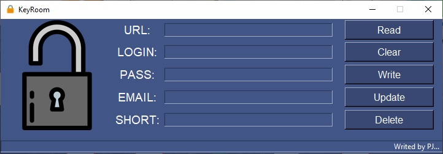

# KeyRoom

***

Application for storing logins, keys, passwords. The data is stored in a database using SQLite3.
Created for Python coding training. No Encrytpion, use at your own risk.

***

## Algorithm:

1. Open application,
2. Check if database exist:
    - If not make DB and inform user,
    - If yes, continue,
3. Read from DB:
    - Inform if is no records,
    - Inform if entry is empty,
    - 'SHOW' will display list of SHORTSs,
4. Write to DB:
    - Inform if form is empty,
    - Inform if there is not enough data,
5. Update DB:
    - SHORT is mandatory, 
6. Delete from DB
    - SHORT or URL is mandatory, 
7. Clear is wiping data from form.

***

`With love, PJ`
